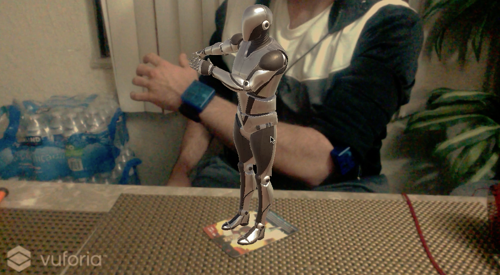
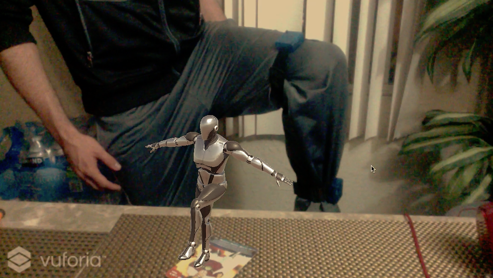

# Real-Time motion capture using inertial measurement units
This project is about the design and construction of a motion capture system based on inertial sensors and its integration with the Unity 3D Game Engine. The system is composed by a  network of wearable wireless sensors from which orientation data can be obtained in the form of Quaternion. Using this data type it is possible to map the movemennts of the user to an augmented reality avatar in real-time.

  
  
  

## Inertial measurement unit
It is an electronic device that uses a combination of accelerometers, gyroscopes and magnetometers to measure forces that are applied to a body. It is commonly used to measure an approxiamte estimation of the orientation of an object, this process is known as sensor fusion.
